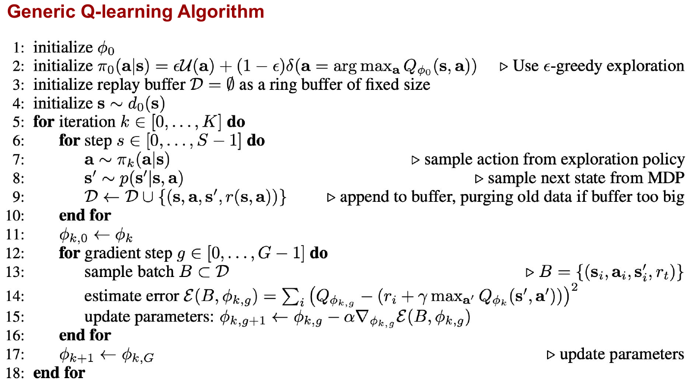
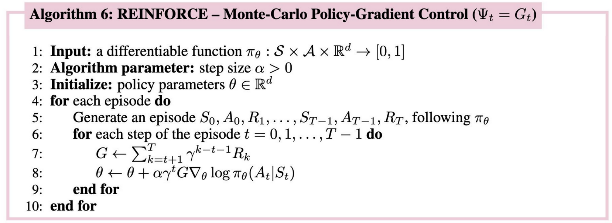

# REINFORCEMENT LEARNING: Policy learning in CartPole environment

The <a src="https://www.gymlibrary.dev/environments/classic_control/cart_pole/" target="_blank">CartPole</a> mission involves balancing a pole on a cart. The goal is to prevent the pole from falling over by moving the cart left or right. The environment consists of a cart that can move along a track, with a pole attached to it. The pole is initially upright, and the agent (the RL algorithm) must take actions to keep it balanced.

The state of the environment is defined by four variables: the cart's position, the cart's velocity, the pole's angle, and the pole's angular velocity. At each time step, the agent can take one of two actions: move the cart left or move the cart right.

The agent receives a reward of +1 for each time step that the pole remains upright. The episode ends if the pole falls too far from the vertical position, the cart moves outside a predefined range, or a maximum number of time steps is reached.

Two learning strategies are studied in this repository: Deep Q-Network (DQN) and REINFORCE.
## Deep Q-Network (DQN)

## REINFORCE

